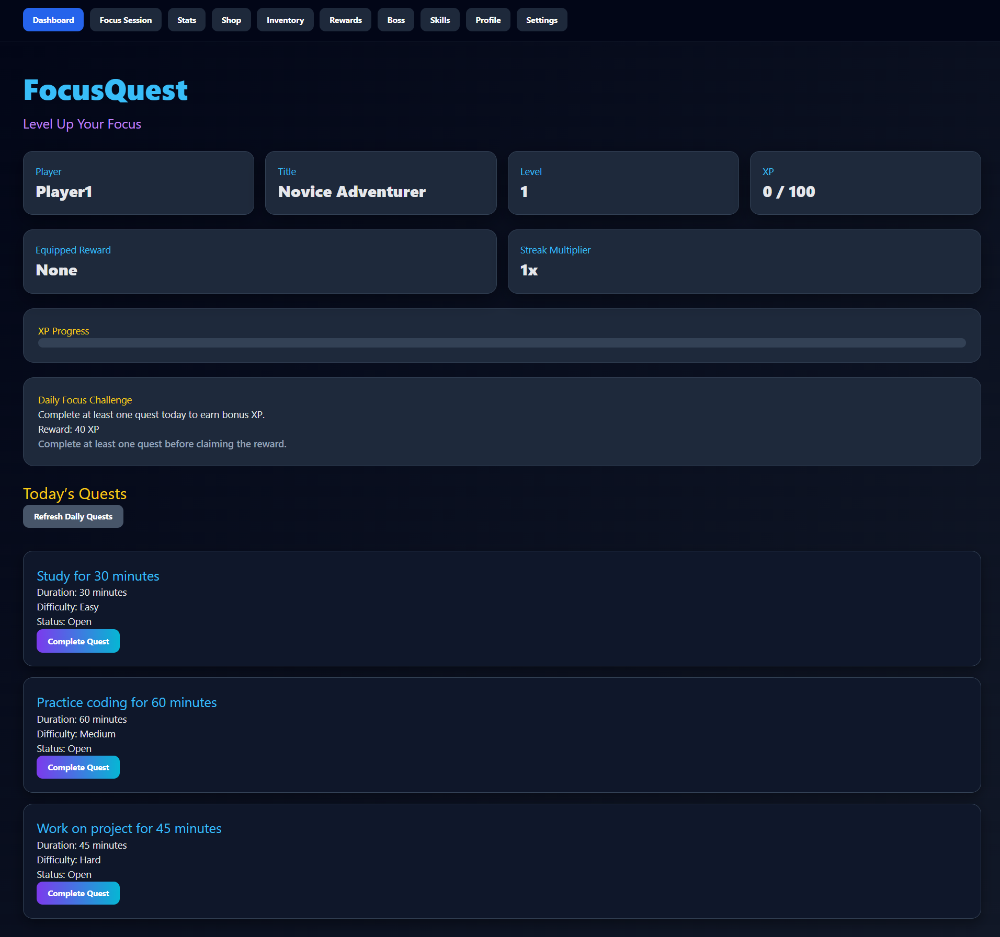
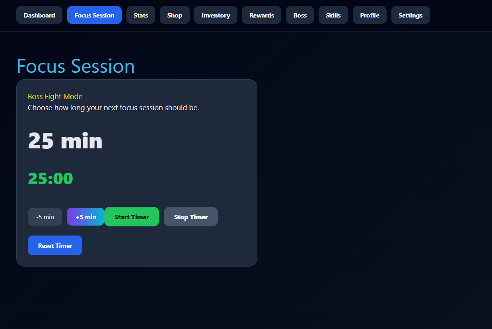
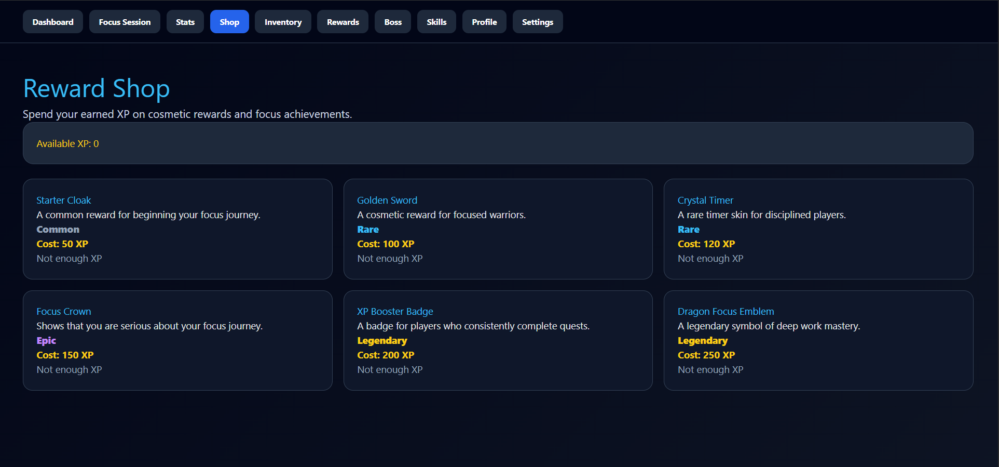
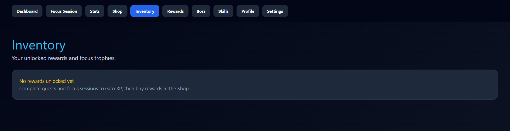
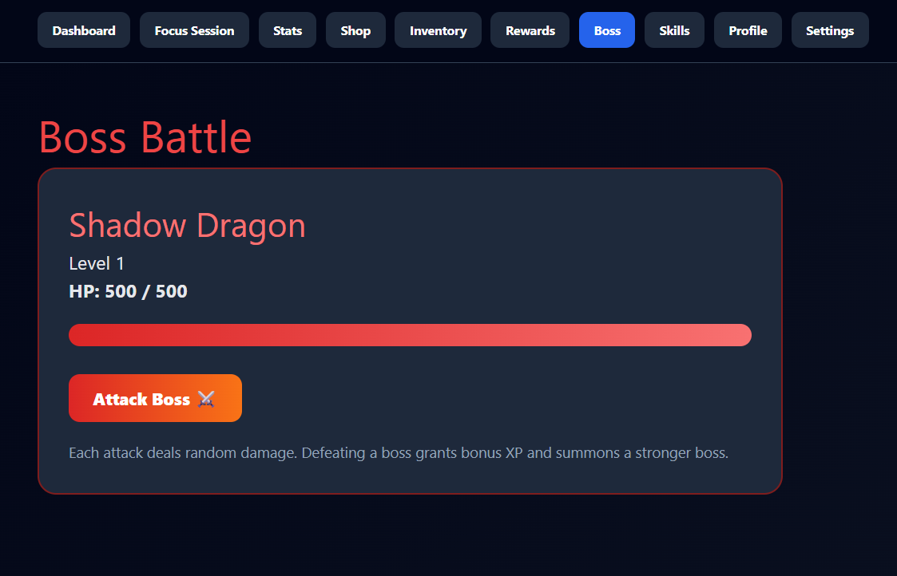
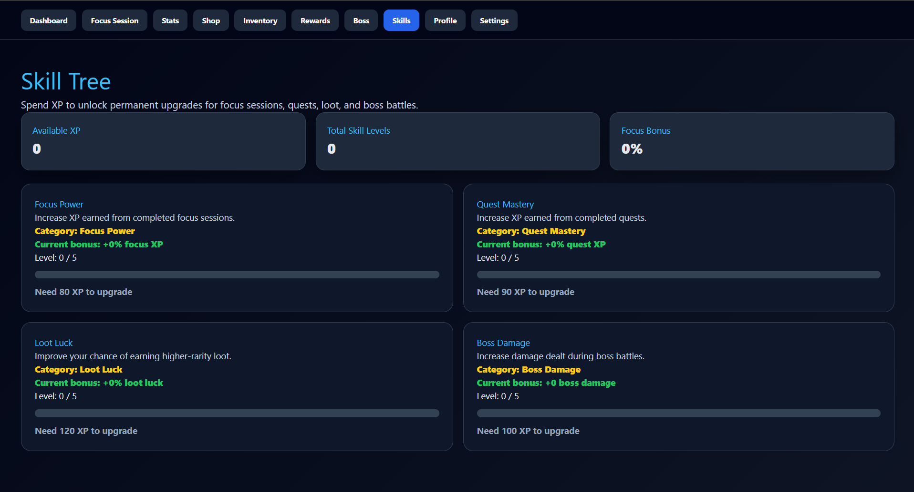
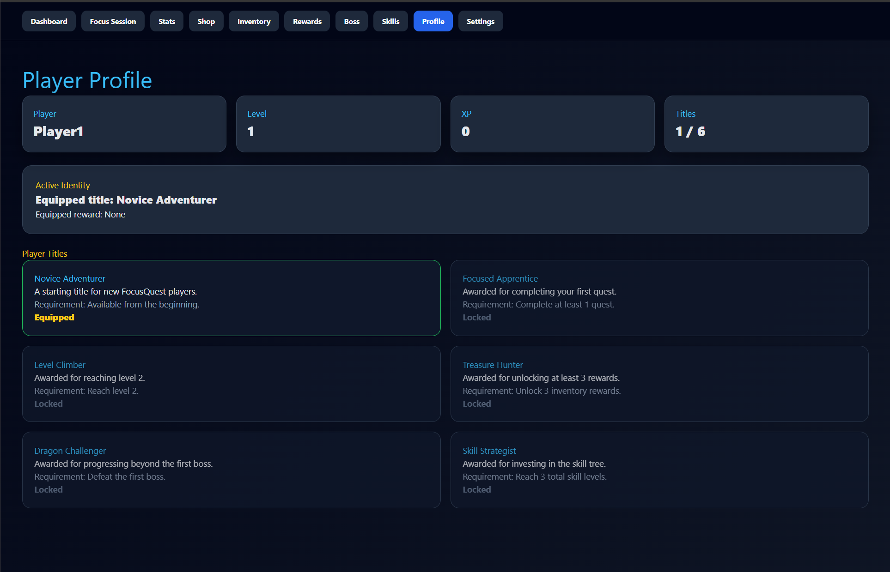

# FocusQuest


A gamified productivity web application built with F#, Bolero and ASP.NET Core.

> Complete quests, earn XP, unlock rewards and level up your focus.

---

## Live Demo

[Open FocusQuest](https://focusquest-b3kq.onrender.com)

---

## About the Project

FocusQuest is a productivity and focus application designed to turn studying, coding and deep work into an RPG-like experience.

Instead of using a traditional task tracker, the application rewards productive work with:

- XP
- levels
- achievements
- inventory rewards
- boss battles
- skill upgrades
- player titles

The goal of the project was to build a larger interactive web application using F#, Bolero and the MVU architecture.

The application combines productivity tools with game mechanics to create a more engaging user experience.

---

## Features

- Complete daily quests
- Earn XP and level up
- Focus session timer
- Start / stop / reset timer
- Daily challenge rewards
- Achievement system
- Player statistics dashboard
- Quest history tracking
- Reward shop
- Inventory system
- Equip purchased rewards
- Item rarity system
- Random loot rewards
- Reward history page
- Boss battle system
- Skill tree upgrades
- Unlockable player titles
- Profile system
- Daily quest refresh system
- Reset progress option

---

## Extra Features

- XP multiplier system
- Streak-based progression
- Random loot drops
- Boss HP scaling
- Focus reward scaling
- Equipped title display
- Equipped inventory item display
- Reward rarity levels:
  - Common
  - Rare
  - Epic
  - Legendary
- Skill upgrade system:
  - Focus Power
  - Quest Mastery
  - Loot Luck
  - Boss Damage
- RPG-inspired UI design
- Multi-page navigation system

---

## UX Highlights

- Modern RPG-inspired interface
- Responsive dashboard layout
- Visual XP progression bars
- Color-coded rarity labels
- Interactive boss battle screen
- Skill tree progression system
- Reward-focused motivation loop
- Large card-based UI sections
- Fast navigation between pages

---

## Tech Stack

- F#
- Bolero
- Elmish
- ASP.NET Core
- .NET 8
- SQLite foundation
- HTML & CSS
- WebAssembly

---

## Architecture

The application follows the **Model-View-Update (MVU)** architecture.

## Omega Scope 

This Omega version extends the original FocusQuest idea into a larger RPG-inspired productivity web application. 

Compared to a basic task tracker, the project includes multiple interconnected systems: 

- player login and class selection 
- XP and level progression 
- daily quests 
- focus timer 
- achievements 
- reward shop 
- inventory 
- random loot rewards 
- boss battles 
- skill tree upgrades 
- unlockable titles 
- profile management 
- statistics and history pages 

The main goal of the Omega version was to create a more complete, polished and feature-rich web application with a clear progression loop and multi-page user experience. 

---

### Model

Stores the full application state:

- player data
- quests
- achievements
- focus timer
- reward shop
- inventory
- reward history
- boss state
- skill tree
- player titles

### Message

Represents all user actions:

- completing quests
- starting timers
- buying rewards
- equipping items
- attacking bosses
- upgrading skills
- refreshing daily quests

### Update

Contains the application logic and updates the model state.

### View

Renders the UI dynamically based on the current state.

---

## Screenshots

### Dashboard



### Focus Session



### Reward Shop



### Inventory



### Boss Battle



### Skill Tree



### Profile Page



---

## Project Structure

```text
FocusQuest
├── src
│   ├── FocusQuest.Client
│   │   ├── Main.fs
│   │   ├── Startup.fs
│   │   └── wwwroot
│   └── FocusQuest.Server
│       ├── Database.fs
│       ├── ProgressService.fs
│       └── Startup.fs
├── FocusQuest.sln
└── README.md
```

---

## Getting Started (Local)

Clone the repository:

```bash
git clone https://github.com/elekvk/FocusQuest.git
```

Go into the project folder:

```bash
cd FocusQuest
```

Run the server project:

```bash
cd src/FocusQuest.Server
dotnet watch run
```

Open the application in the browser:

```text
https://localhost:44316
```

or:

```text
http://localhost:5032
```

---

## Current Status

The project is actively developed.

Completed systems:

- XP and leveling
- Focus timer
- Daily quests
- Achievement system
- Reward shop
- Inventory system
- Boss battle
- Skill tree
- Player titles
- Profile system
- README documentation

Planned improvements:

- Live deployment
- Save/load persistence
- Mobile UI polish
- Additional boss types
- More reward categories
- Animation improvements

---

## Author

Created by **Elek Viktória Krisztina**

GitHub: [@elekvk](https://github.com/elekvk)

---

## License

This project was created for educational and portfolio purposes.